# 🎫 EventTicketing Platform

> Modern end‑to‑end Event Management & Ticketing Ecosystem (Android + Spring Boot, Kotlin)
---
## ✨ Overview
EventTicketing is a full‑stack platform enabling:
- Attendees to discover, evaluate, purchase, store and present tickets.
- Organizers to create, publish, analyze and operate events (sales, check‑in, reporting, insights).
- Administrators to supervise users, events, payments and platform health. (Upcoming deployment)
---
## 🗂 Repository Layout
```
EventTicketing/
├── backend/
├── frontend/
├── README.md
```

---
## 🧱 High‑Level Architecture

```
            +---------------------------+
            |        Android App        |
            |  Jetpack Compose (UI)     |
            |  ViewModel / UseCases     |
            |  Repository Layer         |
            +-------------+-------------+
                          | HTTPS (JWT / JSON)
                          v
                +-----------------------+
                |   Spring Boot API     |
                |  Controllers / DTOs   |
                |  Services (Domain)    |
                |  Repos (JPA/Hibernate)|
                +-----------+-----------+
                            |
                    +-------+--------+
                    |  PostgreSQL    |
                    +----------------+
                            |
                +-----------+-----------+
                | Integrations:        |
                |  • Cloudinary        |
                |  • Firebase (FCM)    |
                |  • SMTP Email        |
                |  • Payments (MoMo)   |
                |  • Export (opencsv)|
                +----------------------+
```
---
## 🧬 Data & Interaction Flow
1. User opens app → splash loads auth state (token from secure storage).  
2. App requests fresh data (events, categories) via Retrofit repositories.  
3. Responses mapped (DTO → domain models) then stored (Room) for offline.  
4. Purchase flow: select ticket types → MoMo payment intent (implemented) → ticket issued + QR generated.  
5. Organizer dashboard fetches analytics endpoints (aggregated metrics).  
6. Push notifications (FCM) inform about status changes.  
7. Check‑in: Scanner reads QR → backend validates ticket → marks attendance.

---
## 🔐 Security Model (Backend)
| Aspect | Implementation |
|--------|----------------|
| Authentication | JWT (access + refresh) |
| Authorization | Role-based (USER / ORGANIZER / ADMIN) with route protection |
| Passwords | BCrypt (Spring Security defaults) |
| Token Transport | HTTP Bearer tokens (Authorization header) |
| Input Validation | Bean Validation (Jakarta) + custom checks |
| Logging Hygiene | (Needs prod adjustments: disable SQL value TRACE) |

---
## 🛠 Technology Stack
### Backend
| Category | Technology / Library | Notes |
|----------|----------------------|-------|
| Language | Kotlin 1.9.25 | JVM 17 toolchain |
| Framework | Spring Boot 3.5.x | Modern AOT capable (optional) |
| Web / REST | spring-boot-starter-web | Controllers, JSON serialization |
| Payments | Custom MoMo integration | VNPay & ZaloPay pending |
| DB | PostgreSQL | TestContainers for integration tests |
| Validation | spring-boot-starter-validation | Jakarta Bean Validation |
| Mail | spring-boot-starter-mail + Thymeleaf | Templated emails |
| OpenAPI | springdoc-openapi | Swagger UI auto-generation |
| Scheduling | Spring Task Scheduling | Periodic tasks (cleanups, etc.) |
| Messaging (Push) | Firebase Admin SDK | Send device notifications |
| Media | Cloudinary SDK | Image hosting / transformation |
| Export | Apache POI, iText (legacy 5.x) | Excel / PDF generation |
| Build | Gradle Kotlin DSL | Jacoco, dependency mgmt |
| Testing | JUnit 5, MockK, Mockito-Kotlin, TestContainers | Layered strategy |
| Metrics | Micrometer + Prometheus registry | Observability endpoints |

### Android
| Category | Technology | Notes |
|----------|-----------|-------|
| Language | Kotlin | Coroutines / Flow |
| UI | Jetpack Compose + Material 3 | Declarative UI |
| Navigation | Navigation Compose + Destinations | Type-safe routes |
| DI | Hilt | Automatic component scoping |
| Local Data | Room + DataStore | Offline caching & lightweight prefs |
| Networking | Retrofit + OkHttp + Moshi/Gson | JSON & interceptors |
| Images | Coil | Async loading / caching |
| Push | Firebase Cloud Messaging | Token registration & channels |
| Auth | Google Sign-In + custom | Combined login flows |
| QR / Barcode | ZXing | Ticket encoding / scanning |
| Charts / Analytics | MPAndroidChart, YCharts | Visual dashboards |
| Animations | Lottie | Rich onboarding & state visuals |
| Date/Time | kotlinx-datetime | Safer time handling |
| Export | OpenCSV | Local CSV generation if needed |

---
## 🧩 Backend Module Structure (Condensed)
```
backend/src/main/kotlin/com/eventticketing/backend/
├── config/          # App, CORS, mail, OpenAPI, schedulers
├── controller/      # REST endpoints (public & secured)
├── dto/             # Request / response payloads
│   ├── event/       # Event + ticket DTOs
│   ├── analytics/   # Aggregated metrics DTOs
│   └── user/        # Auth / profile DTOs
├── entity/          # JPA entities (Event, Ticket, User, Rating, ...)
├── exception/       # Custom exceptions + handlers
├── interceptor/     # (If any request interceptors)
├── repository/      # Spring Data repositories
├── scheduler/       # Scheduled jobs (cleanup / reminders)
├── security/        # JWT utils, filters, config
├── service/         # Interfaces
└── service/impl/    # Implementations (analytics, payments, ...)
```

### Android (Conceptual Layout)
```
frontend/app/src/main/java/com/nicha/eventticketing/
├── data/
│   ├── network/           # Retrofit API definitions
│   ├── repository/        # Concrete repositories
│   ├── local/             # Room DAOs, entities
│   └── mapper/            # DTO ↔ domain conversions
├── domain/
│   ├── model/             # Core business models
│   └── usecase/           # Encapsulated operations (optional)
├── ui/
│   ├── screens/           # Compose screens per feature
│   ├── components/        # Reusable UI elements
│   └── theme/             # Typography, colors, shapes
├── viewmodel/             # State & logic per feature
└── util/                  # Helpers (formatters, validators)
```

---
## 🖼 Visual Assets (Preview)

### Global / Onboarding
| Onboarding 1 | Onboarding 2 | Onboarding 3 |
|--------------|--------------|--------------|
|  |  |  |

### Authentication
| Login | ... | ... |
|-------|----------|-----------------|
| 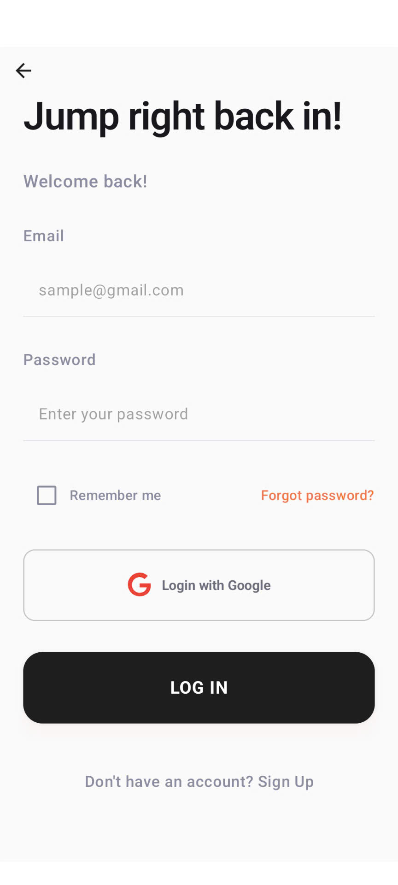||...|

### User (Attendee)
| Home Feed | Event Detail | Ticket Purchase |
|-----------|--------------|-----------------|
| 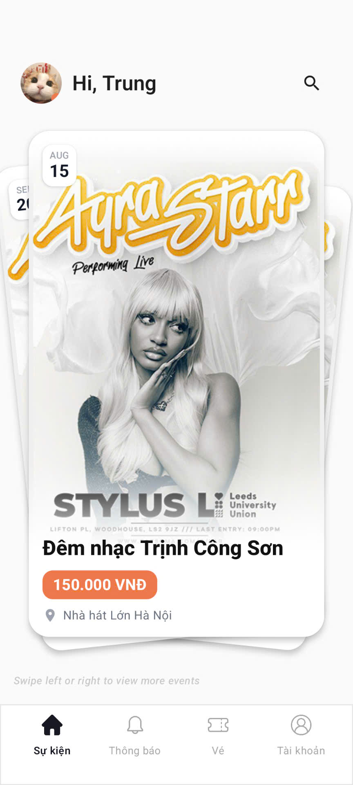|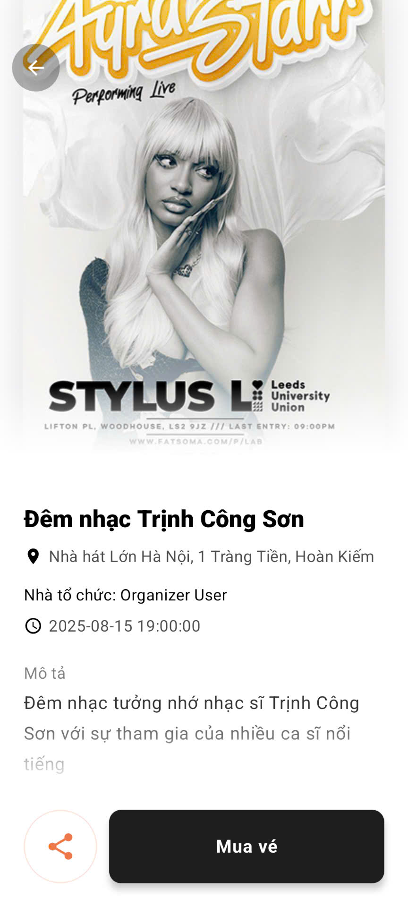|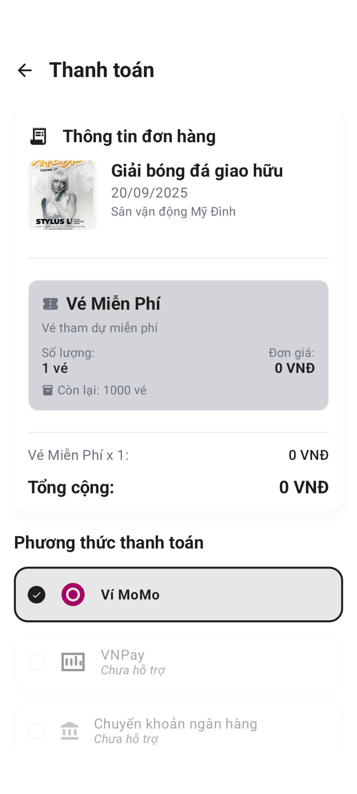|

| Ticket Wallet | Ticket QR |...|
|---------------|----------|-|
| 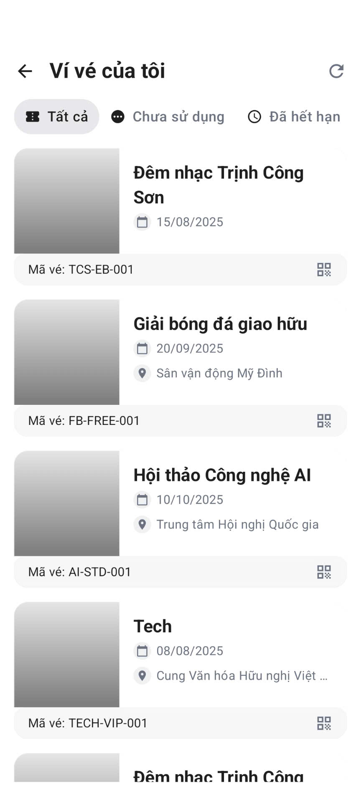|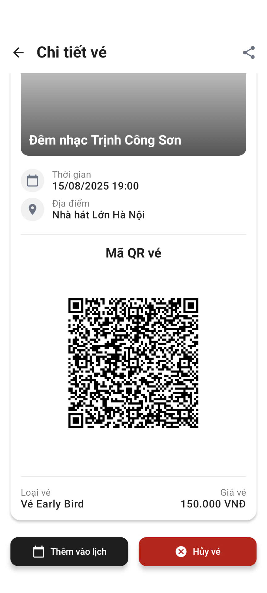|...|

### Organizer
| Organizer Dashboard | Create Event | Create Event (Tickets) |
|---------------------|----------------------|------------------------|
| 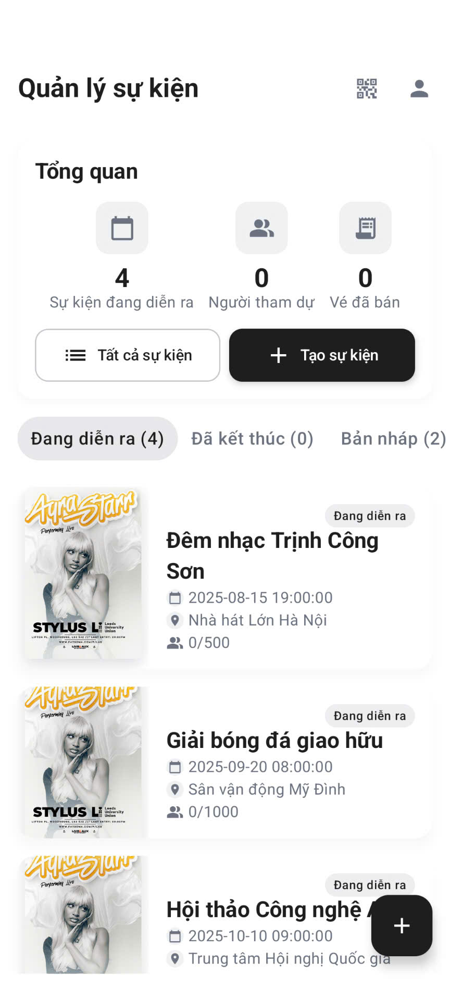|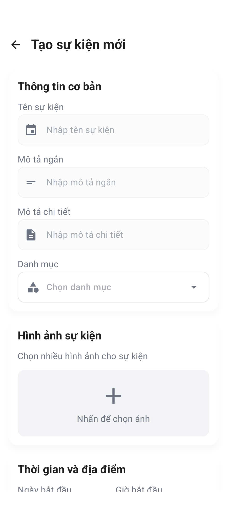|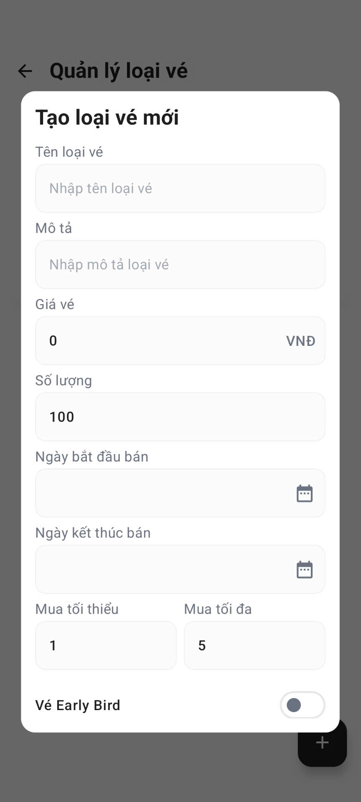|

| Event Analytics | Sales Breakdown | ... |
|-----------------|-----------------|------------------|
| 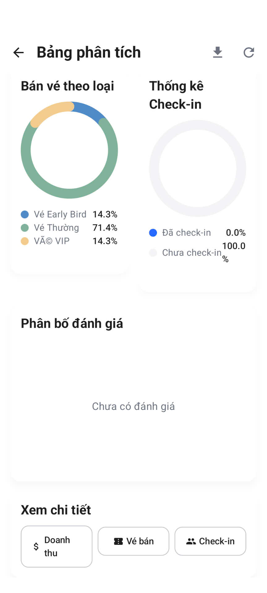|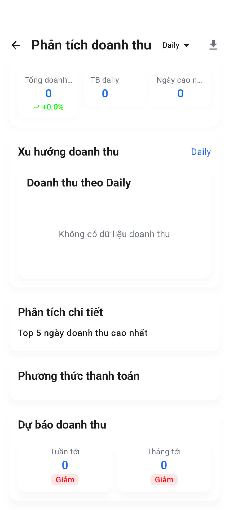|...|
---
## ✅ Feature Matrix
| Area | Implemented | Notes |
|------|-------------|-------|
| Event Discovery | ✔ | Search & filters (keywords, category, etc.) |
| Ticket Purchase | ✔ | Multiple ticket types, QR generation |
| Payments | ✔ (MoMo) | |
| User Auth | ✔ | Email/password + Google Sign-In |
| Notifications | ✔ | FCM push & in-app center |
| Organizer Analytics | ✔ | Revenue, sales, attendance metrics |
| Check-in (QR) | ✔ | Scanner & validation endpoint |
| Exports | ✔ | Excel (POI), PDF (iText) |
| Reporting Scheduler | ✔ | Via Spring scheduling (extendable) |
| Dark Mode | ✔ | Material 3 theming |
| Rate Limiting | ✔  | Add gateway/bucket4j |
| Token Rotation | ✔ | Consider refresh token revocation store |

---
## 📊 Observability & Operations
| Aspect | Implementation |
|--------|----------------|
| Metrics | Micrometer + Prometheus registry |
| Health | Actuator /actuator/health (secured details) |
| Tracing | (Not yet) Consider OpenTelemetry |
| Logging | Logback (file rotation) |
| Alerting | (Future) Integrate with Prometheus + Alertmanager |

---
## 🗺 Roadmap
| Item | Status |
|------|--------|
| Real-time event updates (WebSocket/SSE for sales & check-ins) | Future |
| Event interaction enhancements (real-time comments, reactions, moderation tools) | Future |
| Seat reservation & seating map (select seats, tier pricing) | Future |
| Theming (dynamic colors) | Future |
| Multi-language UI (EN + VI) | Future |
| In-app attendee chat / forum | Future |
---
## ❤️ Acknowledgements
Built with Kotlin, Spring Boot, Jetpack Compose and a passion for clean, maintainable software.
